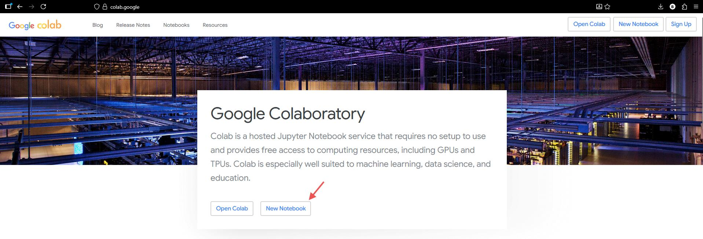
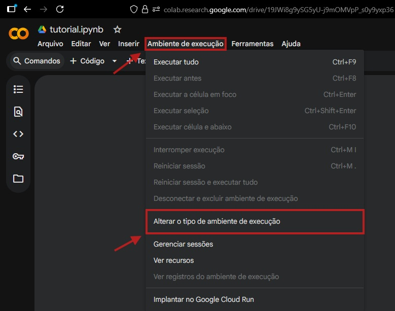
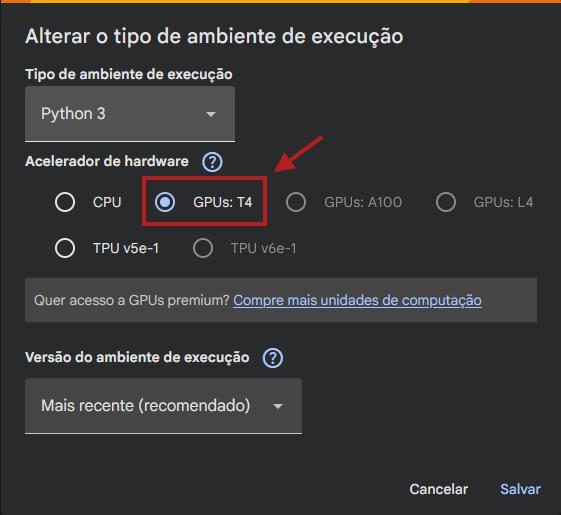
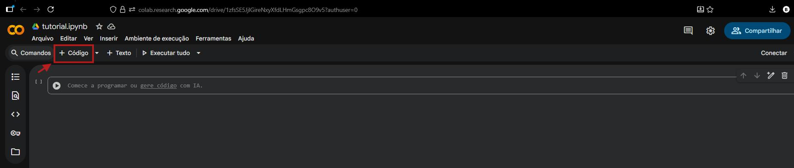
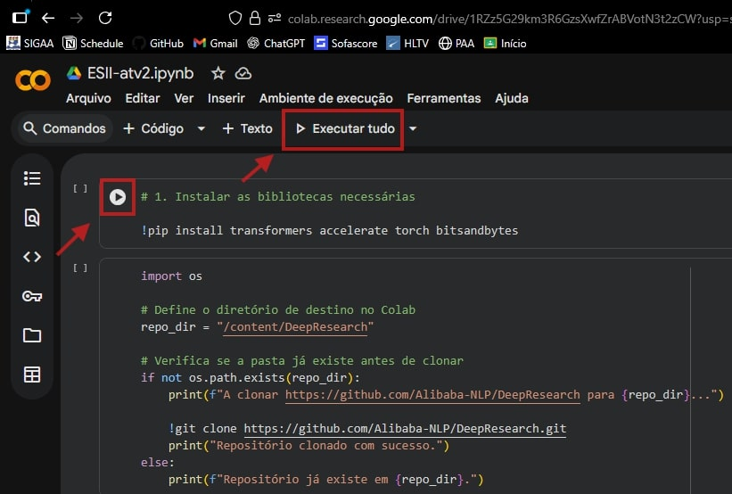
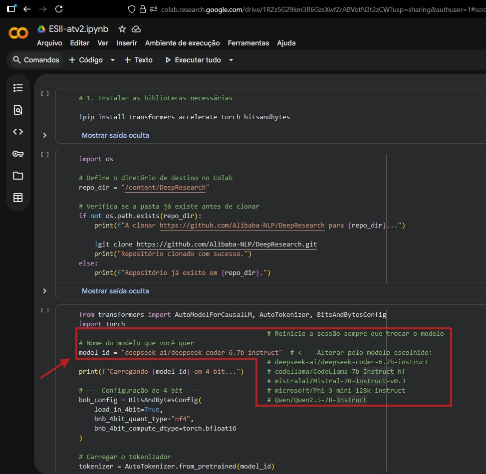
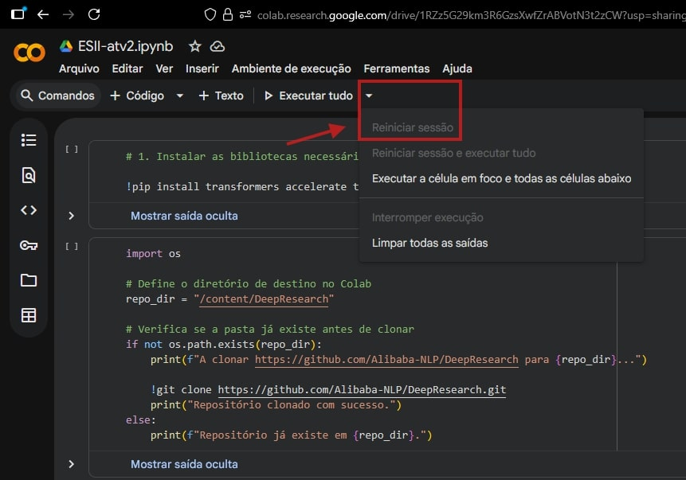

# 📘 Análise do Gerenciamento de Branches do DeepResearch
## Equipe 1 - DeepResearch
| Nome                              | Matrícula     | Descrição da atividade                                                                                   |
|----------------------------------|---------------|-----------------------------------------------------------------------------------------------------------|
| Álex Santos Alencar              | 202300061518  | Realização da análise manual do projeto no GitHub.                                                       |
| Ellen Karolliny dos Santos       | 202300114326  | Análise dos resultados do microsoft/Phi-3-mini                             |
| Gabriel Luiz Santos Gama Barreto | 202300114335  | Auxílio na construção do prompt dos modelos e análise dos relatórios gerados pelo deepseek coder. |
| Gabriel Ramos de Carvalho        | 202300061920  | Ajuda na criação do prompt. Apresentação e discussão dos resultados obtidos a partir do MistralAI. |
| João Andryel Santos Menezes      | 202300061652  | Escolha dos modelos, criação do prompt. Análise dos resultados e apresentação do Phi 3 mini.              |
| Larissa Batista dos Santos       | 202300061705  | Auxílio na construção do tutorial, análise e apresentação dos resultados obtidos utilizando o modelo Qwen2.5.                                        |
| Paloma dos Santos                | 202300061723  | Comparação e análise dos modelos selecionados. Ajuda na criação do modelo do documento .docx (Resposta da análise e tutorial). |
| Rauany Ingrid Santos de Jesus    | 202300061760  | Introdução de Estratégia de releases e modelo de fluxo de trabalho, bem como definição dos conceitos , exemplificação e definição do objetivo da atividade. Alimentação dos slides. Contribuição no documento de análise. |

### DeepResearch - https://github.com/Alibaba-NLP/DeepResearch (Repositório do modelo analisado)
---
## Vídeo de apresentação dos resultados e síntese do projeto
### [Acessar vídeo](https://drive.google.com/file/d/1mzDET2fs4TX35zRRkTenTXPzucnlFj1w/view?usp=drive_link)<br>
---
## 📚 Sobre o Tutorial
---
Este tutorial apresenta como objetivo demonstrar o processo, passo a passo, de como identificar as estratégias de branch do modelo de linguagem DeepResearch a partir de seu repositório no github, utilizando e simulando quatro grandes modelos de linguagem (LLMs), executados a partir do Google Colab.
---
### A escolha dos quatro modelos: DeepSeek-Coder, Mistral, Phi-3 e Qwen, baseia-se em uma estratégia de multiplas perspectivas, na qual cada arquitetura contribui com uma competência específica para a análise do DeepResearch. O DeepSeek funciona como o especialista técnico, focado em entender a lógica por trás de cada mudança no código. Já o Mistral 7B e o Qwen 2.5 7B oferecem um raciocínio mais generalista e boa flexibilidade linguística, o que os torna adequados para interpretar mensagens de commit, comentários e documentações. Por fim, o Phi-3 Mini se destaca pela eficiência, permitindo a análise de grandes janelas de contexto (até 128 mil tokens) com menor custo computacional. Em conjunto, esses modelos possibilitam uma avaliação da estratégia de branches do DeepResearch a partir de múltiplas perspectivas, combinando suas particularidades em prol da análise.
---
## 🚀 Opção de Atalho (Recomendado)
Caso deseje **abrir diretamente o notebook no Google Colab**, sem seguir as etapas iniciais, utilize o link abaixo:

🔗 **Acessar o Notebook no Colab:**  
https://colab.research.google.com/github/GabrielGamaUFS/Evolucao_Software_2025-2_DeepResearch_atividade2/blob/main/ESII_atv2.ipynb

➡️ **Se utilizar esta opção, você pode seguir diretamente para o passo 2 e logo em seguida para o passo 4 do tutorial.**
---
## 🧭 Tutorial Completo

### 1. Abertura do Ambiente Google Colab (IDE)
Nesta etapa, deve-se acessar o ambiente Google Colab, disponível no endereço https://colab.google/, e criar um “Novo Notebook” ou “New Notebook”.

<p align="center">  </p>

---

### 2. Preparação do Ambiente

Nesse momento é importante definir o uso da GPU no Colab. Para isso, acesse o menu “Ambiente de Execução” na parte superior da página, em seguida pressione “Alterar o tipo de ambiente de execução”, selecione a opção “GPUs: T4” e clique em “salvar”, como segue as figuras:

<p align="center">  </p>

<p align="center">  </p>

---

### 3. Inserção do código-fonte
No ambiente do Google Colab, selecione a célula do código já existente. Caso não haja uma célula já criada, pressione a opção “+  Código” para inserir uma nova. 

<p align="center">  </p>

Em seguida, copie cada bloco de código abaixo e cole em cada celúla no Google Colab:

<details>
  <summary><strong>📌 Clique para expandir a 1° célula de código</strong></summary>

```python
# 1. Instalar as bibliotecas necessárias

!pip install transformers accelerate torch bitsandbytes
```
</details>
<details>
  <summary><strong>📌 Clique para expandir a 2° célula de código</strong></summary>

```python
import os

# Define o diretório de destino no Colab
repo_dir = "/content/DeepResearch"

# Verifica se a pasta já existe antes de clonar
if not os.path.exists(repo_dir):
    print(f"A clonar https://github.com/Alibaba-NLP/DeepResearch para {repo_dir}...")

    !git clone https://github.com/Alibaba-NLP/DeepResearch.git
    print("Repositório clonado com sucesso.")
else:
    print(f"Repositório já existe em {repo_dir}.")
```
</details>
<details>
  <summary><strong>📌 Clique para expandir a 3° célula de código</strong></summary>

```python
from transformers import AutoModelForCausalLM, AutoTokenizer, BitsAndBytesConfig
import torch
                                                 # Reinicie a sessão sempre que trocar o modelo
# Nome do modelo que você quer
model_id = "deepseek-ai/deepseek-coder-6.7b-instruct"  # <--- Alterar pelo modelo escolhido:
                                                 # deepseek-ai/deepseek-coder-6.7b-instruct
print(f"Carregando {model_id} em 4-bit...")      # codellama/CodeLlama-7b-Instruct-hf
                                                 # mistralai/Mistral-7B-Instruct-v0.3
# --- Configuração de 4-bit  ---                 # microsoft/Phi-3-mini-128k-instruct
bnb_config = BitsAndBytesConfig(                 # Qwen/Qwen2.5-7B-Instruct
    load_in_4bit=True,
    bnb_4bit_quant_type="nf4",
    bnb_4bit_compute_dtype=torch.bfloat16
)

# Carregar o tokenizador
tokenizer = AutoTokenizer.from_pretrained(model_id)

# Carregar o modelo aplicando a configuração de 4-bit
model = AutoModelForCausalLM.from_pretrained(
    model_id,
    quantization_config=bnb_config,  # <-- Aplicando a configuração de 4-bit
    device_map="auto"                # "auto" coloca o modelo na GPU
)

print("----------------------------------------------------------")
print(f"Modelo {model_id} carregado com sucesso em 4-bit!")
print("----------------------------------------------------------")
```
</details>
<details>
  <summary><strong>📌 Clique para expandir a 4° célula de código</strong></summary>

```python
import subprocess
import glob

# --- 1. FUNÇÃO PARA EXTRAIR INFORMAÇÕES DO REPOSITÓRIO ---
def get_repo_context(repo_path):
    context_data = ""

    # A. Listar Branches e Tags (Indica versionamento)
    try:
        branches = subprocess.check_output(["git", "-C", repo_path, "branch", "-r"], text=True)
        tags = subprocess.check_output(["git", "-C", repo_path, "tag"], text=True)
        context_data += f"--- BRANCHES REMOTAS ---\n{branches}\n"
        context_data += f"--- TAGS (VERSÕES) ---\n{tags}\n"
    except Exception as e:
        context_data += f"Erro ao ler git info: {e}\n"

    # B. Ler os últimos commits (Indica padrão de commit e merge)
    try:
        # Pega os últimos 20 commits formatados para mostrar merges
        logs = subprocess.check_output(
            ["git", "-C", repo_path, "log", "--graph", "--oneline", "-n", "20"],
            text=True
        )
        context_data += f"--- HISTÓRICO DE COMMITS (GRÁFICO) ---\n{logs}\n"
    except:
        pass

    # C. Verificar Workflows do GitHub (Indica CI/CD e Release Automatizada)
    workflows = glob.glob(f"{repo_path}/.github/workflows/*.yml") + glob.glob(f"{repo_path}/.github/workflows/*.yaml")
    if workflows:
        context_data += "--- ARQUIVOS DE WORKFLOW (CI/CD) ENCONTRADOS ---\n"
        for wf in workflows:
            filename = os.path.basename(wf)
            context_data += f"Nome do arquivo: {filename}\n"
            # Lê o conteúdo dos workflows para entender o que eles fazem (ex: publish release)
            with open(wf, 'r') as f:
                context_data += f"Conteúdo de {filename}:\n{f.read()}\n\n"
    else:
        context_data += "--- NENHUM WORKFLOW DE CI/CD ENCONTRADO ---\n"

    # D. Ler README e CONTRIBUTING (Busca regras escritas)
    for doc in ["README.md", "CONTRIBUTING.md", "RELEASE.md"]:
        path = os.path.join(repo_path, doc)
        if os.path.exists(path):
            with open(path, 'r') as f:
                content = f.read()
                # Trunca se for muito grande para não estourar o contexto
                context_data += f"--- ARQUIVO {doc} ---\n{content[:2000]}...\n\n"

    return context_data

# --- 2. PREPARAR O PROMPT ---
print("Coletando dados do repositório...")
repo_context = get_repo_context(repo_dir)

# Ajustamos o texto para ser mais diretivo e evitar que o modelo se alongue demais
instrucao_tarefa = """Você é um Auditor de Código Sênior e Especialista em DevOps.
Sua tarefa é analisar os dados brutos de um repositório Git fornecidos abaixo e extrair fatos reais.
Seja conciso e objetivo em cada ponto."""

corpo_dados = f"""Aqui estão os dados extraídos do repositório:
{repo_context}

Por favor, gere a análise detalhada seguindo EXATAMENTE o formato abaixo."""

# Note que terminamos o prompt com o título do relatório para "puxar" a resposta do modelo
prompt = f"""### Instruction:
{instrucao_tarefa}

{corpo_dados}

### FORMATO DE RESPOSTA ESPERADO:
## Relatório: DeepResearch

**1. Modelo de Fluxo de Trabalho:**
* Veredito:
* Justificativa:

**2. Estratégia de Releases:**
* Veredito:
* Justificativa:

**3. Resumo Geral:**

### Response:
## Relatório: DeepResearch"""

# --- EXECUTAR A INFERÊNCIA ---
print("Gerando análise...")

input_ids = tokenizer(prompt, return_tensors="pt").to("cuda")

outputs = model.generate(
    **input_ids,
    max_new_tokens=1024,   # Limite da resposta
    temperature=0.2,       # Baixa para manter o foco técnico
    repetition_penalty=1.1, # Evita que ele repita as instruções do prompt
    do_sample=True,
    top_p=0.9,
    eos_token_id=tokenizer.eos_token_id
)

# Decodificando
response = tokenizer.decode(outputs[0][input_ids.input_ids.shape[-1]:], skip_special_tokens=True)

# Exibimos o título manualmente já que o usamos para induzir a resposta
print("\n" + "="*50)
print("## Relatório: DeepResearch" + response)
print("="*50)
```
</details>

---

### 4. Execução dos Modelos de Linguagem (LLMs)
Após o código estar inserido, pressione o botão “Executar célula” (ícone de play) ou “Executar tudo” para processar o modelo e aguarde a conclusão da análise realizada pelo LLM. 

<p align="center">  </p>

---

### 5. Repetição da simulação
O procedimento pode ser repetido para cada um dos quatro modelos de linguagem utilizados na simulação, bastando substituir, na linha indicada abaixo, pelo modelo preferido.

<p align="center">  </p>

Após a substituição do modelo, é necessário reiniciar a sessão do ambiente, Para isso, clique na seta para baixo (“Mais ações”) e em seguida “Reinicar sessão”. Logo depois, retorne ao passo anterior.
<p align="center">  </p>

---

## 📄 Documentação da análise dos LLMs

Acesse a versão em PDF contendo:

- Introdução ao tema
- Tutorial
- A análise detalhada
- Conclusões estruturadas
- Comparações entre modelos
- Tabelas <br>
- Referências

### [Acessar documento](docs/ESII-análise-Atividade2.pdf)<br>

